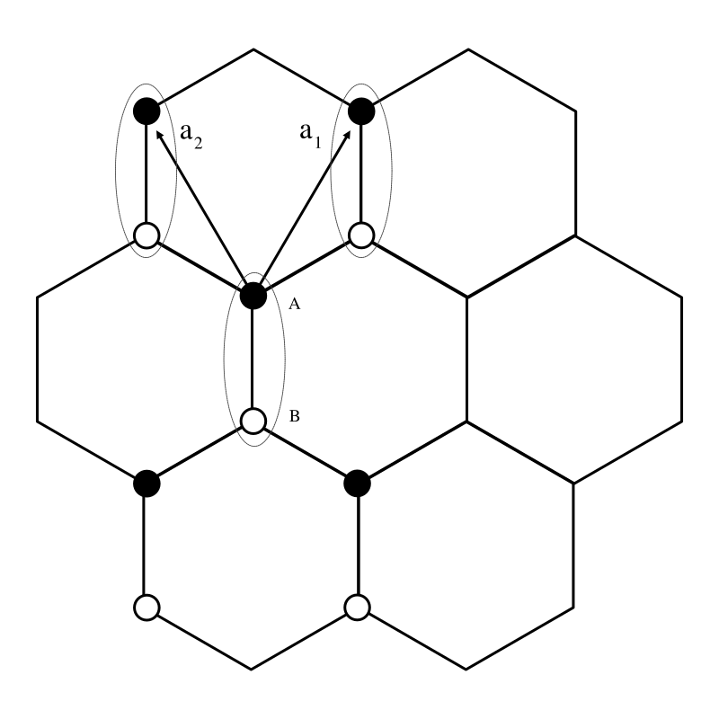

```@contents
Pages = ["tutorial.md"]
```

# Lattice Hamiltonians Tutorial

The main entry point for users of the `LatticeHamiltonians` package is the `@lattice_hamiltonian` macro.

We will work through a few examples of how to use this macro to build Hamiltonians and hen how to use the resulting Hamiltonians to do calculations.

## 1D Nearest neighbor

### Creating a Hamiltonian

As a first example, we will create a Hamiltonian for a 1-dimensional lattice with nearest-neighbor hopping, periodic boundary conditions, and 100 lattice sites.
```math
H = \sum_{\langle ij\rangle} t c_i^\dagger c_j + \sum_i V c^\dagger_ic_i
```

The complete code for construction the Hamiltonian is:

```@example
using LatticeHamiltonians

H = @lattice_hamiltonian begin
    # On site hopings are represented as diagonal elements of a hopping by `0`.
    # Here, it's set to 1.0 for all sites in our 1D lattice.
    # This can be thought of as the energy cost for an electron to exist at a site.
    (0) -> 1.0  # All sites have potential energy 1.0

    # the "hopping" terms, i.e., the probability of an electron "hopping" from one site to a neighboring site.
    (1) -> t # Hopping to the right neighbor with strength t
    (-1) -> t # Hopping to the left neighbor with strength t
  # t is an adjustable parameter, for which we specify a default value below
    t = 1.0

    # L is a list of the number of sites in each dimension.
    # Here, it's [100], meaning we have a 1D lattice (a line) with 100 sites.
    L = [100]  # 1D lattice with 100 sites
end

nothing #hide
```
Some explanation of the domain specific language (DSL) used here is in order.

1. `(0) -> = 1.0  # All sites have potential energy 1.0`

    - We can set an on site potential value for each orbital at a given site. Since this module has only one orbital the on site matrix has is simply a number.

2. `(1) -> t # Hopping to the right neighbor with strength t`

    - Hoppings are specified by the number of lattice sites in each dimension. So for a one-dimensional lattice we have a hopping to the right `1` and to the left `-1`.

3. `t = 1.0`

  - We can set the initial value of arbitrary parameters to be used in the hoppings or on site potential.

4. `L = [100]  # 1D lattice with 100 sites`

    - `L` specifies the number of sites in each dimension of the lattice. Here, we have a 1D lattice with 100 sites.

### Acting on states

The Hamiltonian `H` can be applied to a state vector which is represented `Vector{ComplexF64}` using matrix-vector multiplication
` H * ψ `.

### Calculating eigenvalues and eigenvectors

Eigenvalues and eigenvectors may be computed directly using `Arpack.jl`.
For example,

```julia
using Arpack: eigs
λ = eigs(H)
```


## 2D Nearest neighbor with multiple orbitals

Consider now a model on 2D lattice, with two orbital per site.
We will still only consider periodic boundary conditions and nearest-neighbor hopping.

The second-quantized Hamiltonian is

```math
  H = \sum_{\langle ij\rangle} \sum_{\alpha\beta} t_{\alpha\beta} c_{i\alpha}^\dagger c_{j\beta} + \sum_i \sum_\alpha V_\alpha c^\dagger_{i\alpha}c_{i\alpha}
```

and the corresponding code is

```julia
H = @lattice_hamiltonian begin
  (0) -> [-1.0, 1.0]  # orbitals have different potentials
  # Hopping in the x direction with strength tx
  # only occurs between different orbitals
  (1, 0) -> [0 tx
             tx 0]
  (-1, 0) -> [0 tx
             tx 0]
  # Hopping in the y direction with strength ty
  # only occurs for the same orbital
  (0, 1) -> [ty 0
             0 ty]
  (0, -1) -> [ty 0
             0 ty]
  # Hopping between orbitals on the same site
  (0, 0) -> [0 t0
             t0 0]

  L = [10, 10]  # 2D lattice with 10x10 sites
  tx = 1.0
  ty = 1.2
  t0 = 0.5
end
```

### Acting on states

Even though our lattice is no longer one dimensional the state vector is still represented as a one dimensional vector of complex numbers.
In general, the Hilbert space of a lattice model is represented as tensor product of the orbital quantum number and quantum numbers associated with each lattice vector
```math
\ket{\psi} = \ket{o} \otimes \ket{n_1} \otimes \ket{n_2} \cdots
```
Internally this tensor product is realized as [Kronecker product](https://en.wikipedia.org/wiki/Kronecker_product) of vectors
```math
\vec{\psi} = \vec{o} \otimes \vec{x}_1 \otimes \vec{x}_2 \cdots
```
Note that while the tensor product is commutative, the Kronecker product is not.
As a consequence the state vector is ordered by the site indices and then the orbital indices, with the orbital indices changing fastest.
For example, for a 1D lattice with 2 orbitals per site, the state vector is ordered as `[ψ₁₁, ψ₁₂, ψ₂₁, ψ₂₂, ψ₃₁, ψ₃₂, ...]`.
Conveniently, this is the same ordering obtained if one reshapes an `N` dimensional Julia array into a vector using `vec`,
so one can define a state vector as a Julia array and then reshape it into a vector
```julia
ψN[o, i₁, i₂, i₃, ...] = ...
ψ = vec(ψN)
H * ψ
```

## Worked Example: Graphene

We now use what we have learned to examine the tight-binding structure of graphene.
The typical tight-binding model for graphene is a 2D lattice with two orbitals per site, one for each of the two carbon atoms in the unit cell
```math
H = \sum_{\langle i j \rangle} t \left(a^\dagger_i b_j + b^\dagger_i a_j\right)+ \sum_i \Delta \left(a^\dagger_i a_i - b^\dagger_i b_i\right)
```
where ``a_i`` and ``b_i`` are the annihilation operators for the ``A`` and ``B`` sublattices at site ``i``.
Here we have allowed for a sublattice splitting ``\Delta``.

We can easily construct the lattice Hamiltonian
```@example graphene
using LatticeHamiltonians #hide
H = @lattice_hamiltonian begin
  L = [10, 20] # 2D lattice with 10x20 sites
  (0) -> [Δ, -Δ]
  (0, 0) -> [0 t ; t 0]
  (1, 0) -> [0 0 ; t 0]
  (0, 1) -> [0 0 ; t 0]
  (-1, 0) -> [0 t ; 0 0]
  (0, -1) -> [0 t ; 0 0]
  t = 1.0
  Δ = 0.0
end

nothing #hide
```

The form of the Hamiltonian is best eunderstood by considering the lattice structure of graphene.
The graphene lattice is hexagonal, which can be described as a triangular lattice with two atoms per unit cell, labeled as ``A`` and ``B``.

In the typical nearest-neighbor model of graphene, the hopping term is nonzero only between atoms in different sublattices.
Looking at the figure above, we see that this means hopping can happen either way within a lattice site, but only from ``A`` to ``B`` when moving one direction along the lattice vectors and vice versa for the other direction.

Of course, we can solve this model analytically in the usual way: Fourier transforming to momentum space and diagonalizing the resulting matrix.
Let us define the two component object ``\Psi_i = (a_i, b_i)^T`` in terms of which
```math
H = t\sum_{ij}  \Psi^\dagger_i\left(
\left[\delta_{i_1, j_1}\delta_{i_2, j_2}
+ \delta_{i_1, j_1 + 1}\delta_{i_2, j_2}
+ \delta_{i_1, j_1}\delta_{i_2, j_2 + 1}\right]\hat{\tau}_-
+ h.c.
\right)\Psi_j+ \sum_i \Delta \Psi^\dagger_i \hat{\tau}_3\Psi_i
```
Defining the discrete Fourier transform ``\Psi_i =\frac{1}{\sqrt{L_1L_2}}\sum_{n} \Psi_n \exp\left(\frac{2\pi i n_1 i_1}{L_1} + \frac{2\pi i n_2 i_2}{L_2}\right)``
```math
H = t\sum_{n}  \Psi^\dagger_n\left(
\left[1
+ e^{-2\pi i\frac{n_1}{L_1}}
+ e^{-2\pi i\frac{n_2}{L_2}}
\right]\hat{\tau}_-
+ h.c.
\right)\Psi_n+ \sum_n \Delta \Psi^\dagger_n \hat{\tau}_3\Psi_n
```
For simplicity let us consider the ``Δ=0`` case.
The Schroedinger equation reduces to
```math
t|1 + e^{i\frac{2\pi n_1}{L_1}} + e^{i\frac{2\pi n_2}{L_2}}|\begin{pmatrix}
0& e^{i\phi_{n_1n_2}}\\
e^{-i\phi_{n_1 n_2}}& 0
\end{pmatrix}\mathbf{u}_{n_1n_2}
= E_{n_1n_2}\mathbf{u}_{n_1n_2}
```
with ``\phi_{n_1n_2} = \arg(1 + e^{i\frac{2\pi n_1}{L_1}} + e^{i\frac{2\pi n_2}{L_2}})``.

This an be straightforwardly diagonalized by
```math
\mathbf{u}_{n_1 n_2} = \frac{1}{\sqrt{2}}\begin{pmatrix}
1\\
\pm e^{-i \phi_{n_1n_2}}
\end{pmatrix}
```
with eigenvalues
```math
E_{n_1 n_2; \pm} = \pm t\sqrt{3 + 2 \cos\frac{2\pi n_1}{L_1} + 2\cos\frac{2\pi n_2}{L_2} + 2 \cos\left(\frac{2\pi n_1}{L_1} - \frac{2\pi n_2}{L_2}\right)}.
```

We can see how to verify these solutions with the `LatticeHamiltonians` package.
We can define a state
```@example graphene
using Test #hide
function ψn(n1, n2, L1, L2, ζ)
  k1 = 2π*n1/L1
  k2 = 2π*n2/L2
  ψ = Array{ComplexF64, 3}(undef, 2, L1, L2)

  x = 1.0 + cis(-k1) + cis(-k2)
  phase = x / abs(x)
  u = [1.0, ζ*phase]/sqrt(2.)

  for j = 1:L2
    for i = 1:L1
      ψ[:, i, j] = cis(k1*(i-1) + k2*(j-1))*u
    end
  end
  vec(ψ)/sqrt(L1*L2)
end

function Enζ(n1, n2, L1, L2, ζ)
  k1 = 2π*n1/L1
  k2 = 2π*n2/L2
  ζ*abs(1 + cis(k1) + cis(k2))
end

@testset "Graphene eigenvalues" begin
  @testset for n1=0:(H.L[1]-1), n2=0:(H.L[2]-1), ζ=[1.0, -1.0]
    ψ = ψn(n1, n2, H.L[1], H.L[2], ζ)
    @test isapprox(H*ψ,  H.params[:t]*Enζ(n1, n2, H.L[1], H.L[2], ζ)*ψ)
  end
end

nothing #hide
```

### Real space representation

The above wavefunctions make no reference to the real space structure of the lattice.
They care only about the connectivity of the lattice, and could equally well be used for e.g. a square lattice.
To make contact with the actual hexagonal structure of graphene, we need to additionally include the form of the lattice vectors.

!!! warning "Not yet implemented"
    The real space representation of the Hamiltonian is not yet implemented.

For the orientation of the lattice considered above we have
```math
\mathbf{a}_1 = a \frac{1}{2}(\hat{x} + \sqrt{3}\hat{y})\\
\mathbf{a}_2 = a \frac{1}{2}(-\hat{x} + \sqrt{3}\hat{y})
```
So unit-cell ``i`` is at position ``\mathbf{R}_i = i_1 \mathbf{a}_1 + i_2 \mathbf{a}_2 \equiv \hat{A}\mathbf{i}``,
where ``\hat{A}`` is the matrix with the lattice vectors as its columns.
``LatticeHamiltonians`` provides this matrix as the ``A`` field of the Hamiltonian.
Additionally, the sublattice sites have their own offset within the unit cell, which is given by the ``r`` field of the Hamiltonian:
in general, the offset of orbital ``l`` in unit cell is given by ``H.r[l]``.
